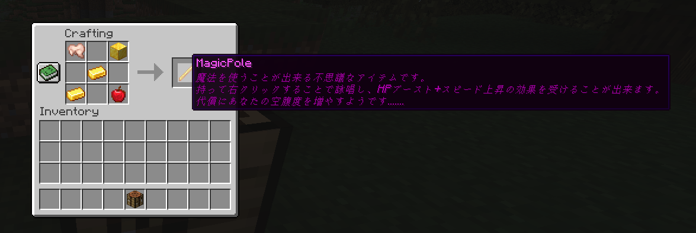

# MagicPole



[Minecraftサーバ開発・運営 Advent Calendar 2021](https://qiita.com/advent-calendar/2021/minecraft-server-dev) - [16日目の記事](https://qiita.com/merunno/items/86bd4023ef2d9e665b3f) で作ったSpigotプラグインです。

カスタムアイテム『MagicPole』とそのカスタムレシピ・魔法を追加します。

[記事:【Spigot】魔法を作る](https://qiita.com/merunno/items/86bd4023ef2d9e665b3f)

## 実装

```md
+ コマンドではなく専用のクラフトレシピを用意する
+ 魔法の詠唱には10秒のディレイを用意する
+ 魔法を使うにはマナ、もとい満腹度を要求する
+ 魔法を詠唱すると **HPブースト・スピード** が付くようにする
```
